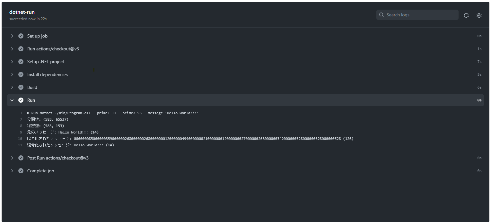

# my-simple-rsa.cs

🗼🗼🗼 RSA暗号をC#で実装してみた！  

  

## 実行方法

```shell
dotnet run --project ./src --prime1 素数A --prime2 素数B --message "メッセージ"
```

例えば、、、  

```shell
dotnet run --project ./src --prime1 11 --prime2 53 --message "Hello World!!!"

公開鍵: (583, 65537)
秘密鍵: (583, 153)
元のメッセージ: Hello World!!! (14)
暗号化されたメッセージ: 000000085000000359000000268000000268000000012000000494000000021000000012000000027000000268000000342000000528000000528000000528 (126)
復号化されたメッセージ: Hello World!!! (14)
```

正しく暗号化・復号化できていることが確認できます。  

GitHub Actionsでも実行しています。  
`./.github/workflows/run.yml`の`dotnet-run`ジョブ内の`Run`ステップを参照してください。  

---

テストするには、、、  

```shell
dotnet test ./Tests
```
